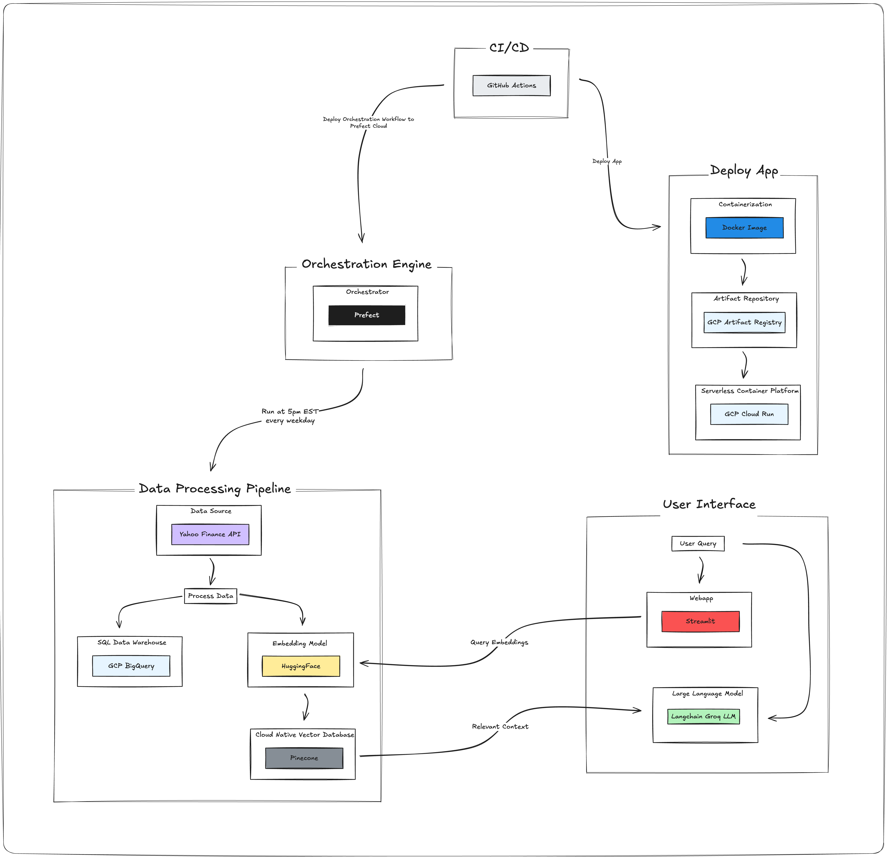

# RAG-LLM Powered Stock Recommendation System

## Summary

An intelligent stock portfolio recommendation system powered by RAG (Retrieval-Augmented Generation) technology and large language models. This application combines real-time financial data with advanced AI to provide personalized investment insights and portfolio recommendations through an intuitive web interface.

The system utilizes a batch processing pipeline to continuously update stock data and embeddings, enabling semantic search capabilities that help users discover relevant investment opportunities based on natural language queries.

## System Architecture

The application follows a modern batch RAG-LLM architecture with two main pipelines:

### Batch Indexing Pipeline
- **Data Sources**: Yahoo Finance API for real-time stock data and financial metrics, NewsAPI & HuggingFace Sentiment Analysis model for stock sentiment
- **Data Storage**: BigQuery for structured historical data storage
- **Document Processing**: LangChain for data chunking and preprocessing
- **Embedding Generation**: HuggingFace Embedding model convert text to semantic vectors
- **Vector Storage**: Pinecone for scalable similarity search and retrieval

### Query Processing Pipeline
- **Web Interface**: Streamlit-based user interface for natural language queries
- **Query Embedding**: Same embedding model ensures semantic consistency
- **Vector Search**: Pinecone performs similarity search to find relevant stock data
- **Context Assembly**: Retrieved documents are combined for comprehensive context
- **LLM Generation**: LangChain Groq generates personalized portfolio recommendations
- **Results**: Data-driven investment insights and stock analysis

## Tools & Technologies

### Data & Infrastructure
- **Yahoo Finance API** - Real-time stock data and financial metrics
- **Google BigQuery** - Scalable data warehouse for structured stock data storage
- **Pinecone** - Managed vector database for semantic search capabilities
- **Prefect** - Workflow orchestration for automated data pipeline scheduling

### AI & Machine Learning
- **LangChain** - Framework for building LLM-powered applications
- **Groq** - High-performance inference for fast embedding generation and text completion
- **RAG (Retrieval-Augmented Generation)** - Combines retrieval and generation for accurate, contextual responses

### Frontend & Deployment
- **Streamlit** - Interactive web application framework
- **Python** - Primary development language
- **Git** - Version control with dev/main branch deployment strategies

### Key Features
- 🔄 **Automated Data Pipeline**: Daily updates of stock data and embeddings (5PM EST, weekdays)
- 🧠 **Semantic Search**: Natural language queries to find relevant investment opportunities
- 📊 **Real-time Analysis**: Fresh financial data for up-to-date portfolio recommendations
- 🎯 **Personalized Insights**: AI-powered analysis tailored to user investment preferences
- ⚡ **Fast Performance**: Groq-powered inference for rapid response times
- 🌐 **Web Interface**: User-friendly Streamlit application for easy interaction

## Architecture Benefits

- **Scalability**: Batch processing handles large datasets efficiently
- **Accuracy**: RAG ensures responses are grounded in real financial data
- **Performance**: Vector search enables fast semantic retrieval
- **Maintainability**: Modular pipeline design for easy updates and monitoring
- **Real-time Insights**: Continuous data updates keep recommendations current